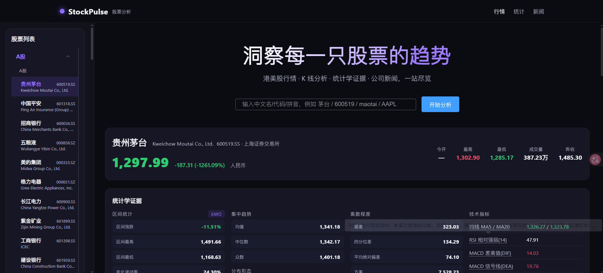

# 📈 StockPulse · 股票分析网站

洞察每一只股票的趋势 —— 港美股 + A股行情、K 线分析、统计学证据、公司新闻，一站尽览。



## ✨ 功能特性

- **三大市场**：A股（上交所/深交所）、美股、港股，支持任意股票代码/中文名/拼音/英文名搜索
- **K 线图**：日K / 时K / 周K / 月K 四周期切换，叠加 MA5/MA20/MA60 均线、成交量、MACD
- **统计学证据**（全指标实时计算）：
  - 集中趋势：均值 / 中位数 / 众数
  - 离散程度：极差 / 四分位差 / 平均绝对偏差 / 方差 / 标准差
  - 分布形态：偏度 / 超额峰度
  - 矩阵分析：5×5 协方差矩阵 + 相关系数热力图（颜色与股票涨跌色一致）
- **数形结合**：价格分布直方图（分箱数滑块可调，均值/中位数虚线标注，众数高亮于柱顶）
- **数学分析 · 持有建议**：基于统计与技术指标的长期/短期评分，给出持有建议
- **技术指标**：MA / RSI / MACD / BOLL / 趋势判定（悬停显示指标含义）
- **公司新闻**：列表展示 + 站内抽屉查看完整正文（爬虫抓取，不跳转外部）
- **响应式**：桌面固定侧栏 + 移动端抽屉菜单

## 🛠 技术栈

- 前端：**Vue 3 + Element Plus + animejs + echarts**（Vite 开发服务器 + yarn 管理依赖，本地化于 `node_modules/`）
- 后端：**Python 标准库**（http.server API 服务，转发行情 + 爬取新闻 + 翻译）
- 数据源：Yahoo Finance 行情（后端代理绕过 CORS）、Yahoo 新闻

## 🚀 快速开始（前后端分离）

项目采用前后端分离架构：

```bash
# 1. 启动后端 API 服务（stockpulse-backend/，端口 8000）
cd stockpulse-backend
python server.py

# 2. 启动前端开发服务器（stock-analysis/，端口 5173，代理 /api → 8000）
cd ../stock-analysis
yarn install   # 首次
yarn dev

# 3. 浏览器打开
http://localhost:5173
```

> 后端无第三方依赖（纯 Python 标准库）；前端 Vite + yarn 管理依赖（本地化于 node_modules/）。

## 📁 项目结构（前后端分离）

```
StockPulse/
├── stock-analysis/          # 前端（Vite）
│   ├── index.html           # 页面入口
│   ├── style.css            # 全局样式（深色紫色主题）
│   ├── app.js               # 根组件：状态管理 + 数据加载
│   ├── vite.config.mjs      # Vite 配置（/api 代理到后端 8000）
│   ├── package.json / yarn.lock
│   ├── node_modules/        # 前端依赖（yarn 管理）
│   ├── components/
│   │   ├── header.js        # 顶部导航
│   │   ├── aside.js         # 侧边栏（el-menu 分组）
│   │   ├── main.js          # 主内容（详情/统计/K线/直方图/热力图）
│   │   └── newslist.js      # 公司新闻（列表 + 站内抽屉查看）
│   └── public/              # 静态资源（预览图等）
└── stockpulse-backend/      # 后端（Python 纯 API）
    ├── server.py            # API 服务（/api/chart、/api/search、/api/news-content、/api/translate）
    └── crawler/
        └── news_crawler.py  # 新闻爬虫（标题 + 正文段落提取）
```

## 📊 统计面板说明

| 分组 | 内容 |
|------|------|
| 区间统计 | 区间涨跌 / 最高最低 / 年化波动率 / 最大回撤 / 量比 |
| 集中趋势 | 均值 / 中位数 / 众数 |
| 离散程度 | 极差 / 四分位差 / 平均绝对偏差 / 方差 / 标准差 |
| 分布形态 | 偏度 / 超额峰度 |
| 矩阵分析 | 相关系数热力图 + 协方差矩阵（开/高/低/收/量）|
| 技术指标 | MA / RSI / MACD / BOLL / 趋势判定 |
| 持有建议 | 长期/短期评分（0-4）+ 综合建议 |

## ⚠️ 免责声明

本项目仅供学习与技术交流使用，所有数据来自公开接口，不构成任何投资建议。股市有风险，投资需谨慎。

## 📄 License

MIT
